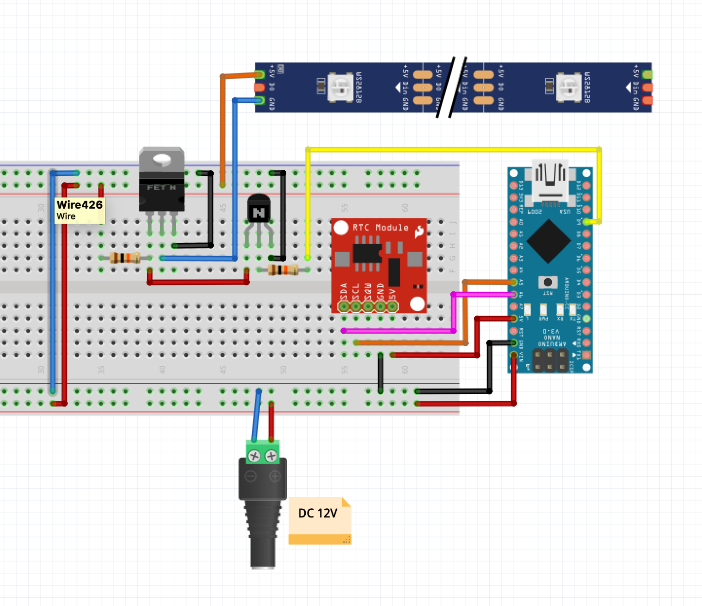
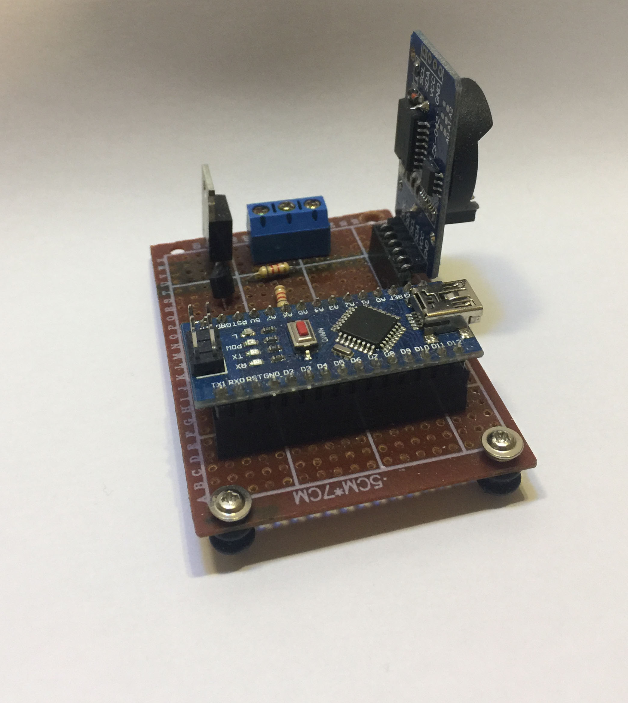

# Scuti 
Source code of the sun lamp for  parrot built with an Arduino. 

#  How it works
My bird's native country is Australia so I looked at the sun path in Australia. Budgerigars have an extensive natural range. They’re found through most of Australia's interior west of the Great Dividing Range. It's  Dawn at 05:42 A.M and dusk at 7:45 P.M there. You can find the sun path on [here.](https://www.suncalc.org/#/-24.4684,133.0223,3/2021.02.09/06:09/1/3 )

The task of the lamp is to turn it on in the morning and turn off at night. It's not sudden, it's slow.

# Components used:
* Arduino Nano
* DS3231
* Module Led
* IRFZ44 N Mosfet
* BC547 NPN Transistör
* 2 x 10 kΩ Resistance 
* 3 Pin Screw Terminal
* Perfboards
* DC 12 V Adapter

# Circuit

# My Circuit

